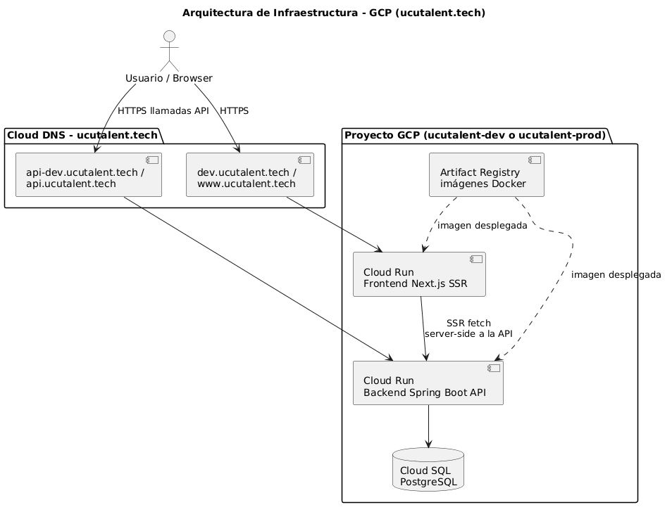

# UCU Talent — Infraestructura
 
Documentación central de la infraestructura del proyecto **UCU Talent**, un portal laboral que conecta empresas, alumnos y egresados de la Universidad Católica del Uruguay.
 
Este repositorio reúne las decisiones de arquitectura, el pipeline de CI/CD, la configuración de base de datos, el manejo de secretos, la observabilidad de la infraestructura y el plan de portabilidad hacia otro proveedor cloud.
 
---
 
## Arquitectura general
 
El proyecto está desplegado íntegramente en **Google Cloud Platform (GCP)**, con una arquitectura monolítica (decisión tomada explícitamente por restricciones de tiempo). Consta de dos servicios en contenedores, una base de datos relacional y un bucket para almacenamiento de archivos.
 
 
 
| Componente | Servicio en GCP |
|---|---|
| Backend (API, Java + Maven) | Cloud Run (`api-dev` / `api-prod`) |
| Frontend (Next.js) | Cloud Run (`web-dev` / `web-prod`) |
| Registro de imágenes Docker | Artifact Registry |
| Base de datos | Cloud SQL for PostgreSQL 17 |
| Almacenamiento de archivos (CVs, fotos de perfil) | Cloud Storage |
| Gestión de secretos | Secret Manager |
| Autenticación del CI/CD | Service Account key (`GCP_SA_KEY`) |
| CI/CD | GitHub Actions |
| Flujo de versionado | Git Flow |
 
La autenticación de la aplicación es propia (JWT con cookie httpOnly), no depende de un servicio de identidad externo.
 
---
 
## Índice de documentación
 
### Flujo de trabajo
 
| Documento | Descripción |
|---|---|
| [Git Workflow](./docs/git-workflow.md) | Estrategia de ramas (Git Flow), nomenclatura y reglas de contribución del equipo. |
 
### CI/CD
 
| Documento | Descripción |
|---|---|
| [CI/CD Backend](./docs/ci-cd-backend.md) | Pipeline de GitHub Actions para el backend Java + Maven: test, build check, escaneo con Trivy y deploy a Cloud Run (`api-dev` / `api-prod`). |
| [CI/CD Frontend](./docs/ci-cd-frontend.md) | Pipelines de GitHub Actions para el frontend Next.js: workflows separados por ambiente, build con `NEXT_PUBLIC_API_BASE_URL`, escaneo con Trivy y deploy a Cloud Run (`web-dev` / `web-prod`). |
 
### Base de datos
 
| Documento | Descripción |
|---|---|
| [Cloud SQL](./docs/cloud-sql.md) | Configuración de la instancia PostgreSQL, organización de usuarios y roles bajo el principio de mínimos privilegios. |
| [Cloud SQL Auth Proxy](./docs/cloud-sql-auth-proxy.md) | Cómo conectarse a la base de datos desde un cliente PostgreSQL (DataGrip, DBeaver, pgAdmin, etc.) usando el proxy. |
| [Setup del entorno local](./docs/cloud-sql-local-setup.md) | Guía paso a paso para instalar Google Cloud SDK, autenticarse y levantar el backend localmente contra Cloud SQL. |
 
### Almacenamiento de archivos
 
| Documento | Descripción |
|---|---|
| [Bucket Flow](./docs/bucket-flow.md) | Flujo de subida de CVs y fotos de perfil: el backend sube el archivo al bucket vía SDK de Google Cloud y obtiene una signed URL con tiempo de expiración, usando la Service Account por defecto de la instancia de Cloud Run. Funcionalidad exclusiva de los entornos desplegados, no disponible en local por motivos de seguridad. |
 
### Seguridad y secretos
 
| Documento | Descripción |
|---|---|
| [Secret Manager](./docs/secret-manager.md) | Convención de nombres, listado de secretos por entorno (DEV/PROD) y procedimiento para crear nuevos secretos. |
 
### Observabilidad
 
| Documento | Descripción |
|---|---|
| [Monitoring](./docs/monitoring.md) | Estrategia de observabilidad: Cloud Logging, Cloud Monitoring, dashboards por ambiente y políticas de alerta configuradas. |
| [Guía de uso de Monitoring](./docs/monitoring-user-guide.md) | Guía práctica para navegar Cloud Monitoring, revisar dashboards, alertas, logs y Error Reporting ante un incidente. |
| [Alternativas de implementación](./docs/monitoring-implementation-alternatives.md) | Cómo replicar la misma estrategia de observabilidad en Azure (Azure Monitor, Log Analytics, Application Insights) o en un Data Center on-premises (Prometheus, Grafana, ELK). |
 
### Costos
 
| Documento | Descripción |
|---|---|
| [Billing](./docs/billing.md) | Desglose de costos mensuales por servicio. Cloud SQL representa el mayor porcentaje del gasto de infraestructura. |
 
### Decisiones y portabilidad
 
| Documento | Descripción |
|---|---|
| [Decisiones del proyecto](./docs/decisions.md) | Resumen de las decisiones de infraestructura tomadas: proveedor, base de datos, servicios utilizados, CI/CD y flujo de Git. |
| [Migración GCP → Azure](./docs/migration/gcp-to-azure-migration.md) | Mapeo de servicios equivalentes, cambios necesarios en backend/frontend/CI-CD y plan de migración por fases. |
| [Migración GCP → Datacenter UCU](./docs/migration/gcp-to-ucu-datacenter-migration.md) | Mapeo de servicios equivalentes, cambios necesarios en backend/frontend/CI-CD y plan de migración por fases. |
 
---
 
## Estructura del repositorio

```
ucu-talent-infra/
├── database/     Scripts SQL de usuarios, roles y permisos por ambiente
└── docs/         Documentación de la infraestructura
│   ├── diagrams/  Diagramas de arquitectura
│   ├── images/    Capturas utilizadas en las guías
│   └── migration/ Planes de migración a otros proveedores
```

La configuración de la base de datos por ambiente está documentada en [database/readme.md](database/readme.md).
 
## Ambientes
 
El proyecto opera con dos ambientes completamente separados, tanto en GitHub (Environments) como en GCP:
 
| Ambiente | Rama | Servicios | Base de datos | Frontend | API |
| -------- | ---- | --------- | ------------- | -------- | --- |
| DEV / QA | `dev` | `web-dev` / `api-dev` | `ucu_talent_database_dev` | https://dev.ucutalent.tech | https://api-dev.ucutalent.tech |
| PROD | `main` | `web-prod` / `api-prod` | `ucu_talent_database_prod` | https://www.ucutalent.tech | https://api.ucutalent.tech |
 