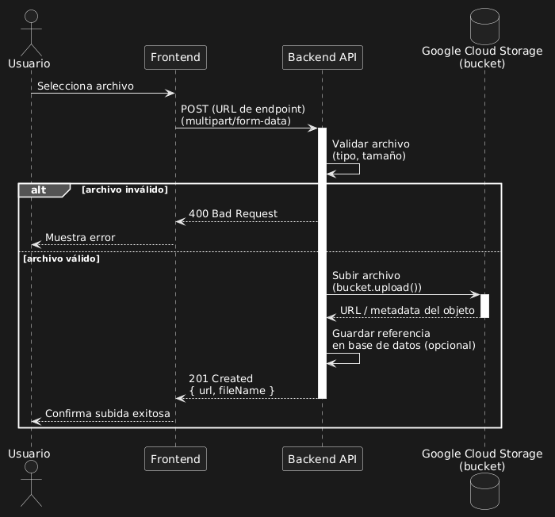

# Bucket Flow

## Descripción

Para guardar las fotos de perfil de los usuarios y CVs utilizamos un bucket en **Google Cloud Storage** de **GCP**.

### Flow

- El Cliente (Frontend) sube un CV o foto de perfil realizando una peticion HTTPS al Backend, el Back es el encargado de subir el archivo al bucket mediante el **SDK** de **Google Cloud**.

- Luego de subido el archivo, el bucket genera una url accesible con el archivo la cual es enviada al back.

#### Las credenciales con las cuales se autentica ante el Servicio de Google Cloud son de la Service Account de GitHub Actions.

---

### Diagrama de Secuencia

