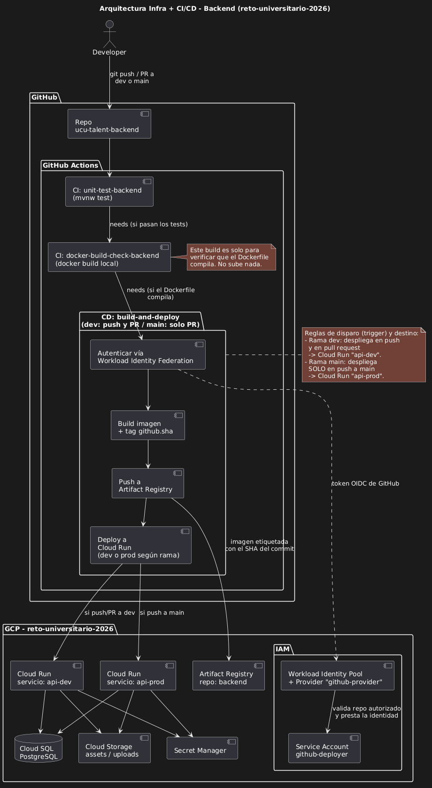

# CI/CD Backend Java + Maven

Documentación del pipeline de integración y despliegue continuo del backend definido en '.github/workflows/' (GitHub Actions).

## Idea central

El pipeline corre los test unitarios y valida el build de la imagen docker en cada PR que se crea a 'dev' o a 'main'. Cuando se hace push a 'dev' o 'main', 
ademas construye la imagen y la sube a artifact registry y la despliega en cloud run.

## Trigger

El workflow se dispara así:

Pull request a dev o main --> dispara el CI (Corre test unitarios y buildea la imagen docker)
Push a dev o main --> dispara el CD correspondiente a su ambiente (Corre el CI, si pasa buildea la imagen para artifact y la despliega en una instancia de cloud run).

## Jobs

### 1. 'unit-test-backend' (CI)

  - Da permiso de ejecución a 'mvnw'
  - Configura Java 21 con el cache de Maven.
  - Corre './mvnw test'

### 2. 'docker-build-check-backend' (CI)

  - Chequea que el job anterior haya pasado.
  - Construye la imagen solo para verificar que el DockerFile comipla. Luego la destruye.
  - Ejecuta un escaneo de vulnerabilidades sobre la imagen utilizando Trivy, buscando vulnerabilidades de severidad HIGH y CRITICAL tanto del sistema operativo como de las dependencias (`os,library`). El escaneo es informativo y no bloquea el pipeline, aunque se detecten vulnerabilidades.

## 3. `build-and-deploy-dev` y `build-and-deploy-prod` (CD)

  - Chequea que los dos jobs de CI hayan pasado.
  - En Development solo corre cuando el evento es un `push` a `dev`; en Production solo cuando el `push` es a `main`.
  - Usa el ambiente de GitHub correspondiente (`development` o `production`), donde están configuradas las variables y secretos necesarios.
  - Autentica contra Google Cloud usando el secret `GCP_SA_KEY` (service account key).
  - Configura Docker para autenticar contra Artifact Registry.
  - Construye la imagen y la tagea con el SHA del commit.
  - Pushea la imagen a Artifact Registry.
  - Deploy a Cloud Run ('api-dev' o 'api-prod', región `us-central1`), inyectando variables de entorno(vars) y secretos desde Google Secret Manager.
  
## 4. Debuggear

 - Fallo en tests o build check: revisar logs del job correspondiente en la pestaña Actions del PR/commit.
 - Fallo en auth contra GCP: verificar que 'GCP_SA_KEY' no haya expirado o que la service account tenga los permisos necesarios (Artifact Registry Writer, Cloud Run Admin, Secret Manager Accessor).
 - Fallo en el deploy a Cloud Run: revisar que los nombres de secrets en Secret Manager coincidan exactamente con los referenciados en el workflow, y que las `vars.*` estén seteadas en el ambiente correspondiente de GitHub.
 - La imagen se subió pero el servicio no arranca: revisar logs del servicio en Cloud Run (Console → Cloud Run → api-dev/api-prod → Logs).
 - Trivy reportó vulnerabilidades: revisar la salida del step "Scan Docker image with Trivy" en GitHub Actions. El reporte muestra las vulnerabilidades detectadas (HIGH y CRITICAL) sin bloquear el pipeline.

## 5. Diagrama

