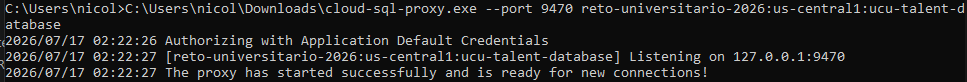

# Conexión a Cloud SQL desde un cliente PostgreSQL

> **Importante:** Antes de seguir esta guía, completar la [Guía de configuración del entorno local](./cloud-sql-local-setup.md). Allí se explica cómo instalar Google Cloud SDK, autenticarse en Google Cloud y configurar las credenciales necesarias para acceder al proyecto.

Esta guía explica cómo conectarse a una base de datos de Google Cloud SQL desde un cliente PostgreSQL (DataGrip, IntelliJ IDEA, DBeaver, pgAdmin, entre otros) utilizando Cloud SQL Auth Proxy.

---

# 1. Descargar Cloud SQL Auth Proxy

Descargar el ejecutable para Windows (64 bits):

https://storage.googleapis.com/cloud-sql-connectors/cloud-sql-proxy/v2.23.0/cloud-sql-proxy.x64.exe

Una vez descargado, renombrar el archivo a:

```text
cloud-sql-proxy.exe
```

---

# 2. Ejecutar el proxy

Ejecutar el siguiente comando desde la carpeta donde se encuentra el ejecutable:

```bash
cloud-sql-proxy --port 9470 reto-universitario-2026:us-central1:ucu-talent-database
```

> **Nota:** Si el puerto `5432` no está siendo utilizado, también puede utilizarse en lugar de `9470`.

Si el proxy inició correctamente, debería aparecer lo siguiente:



### ⚠️ **Mantener esta terminal abierta mientras se utilice la base de datos.**

---

# 3. Configurar el cliente PostgreSQL

Crear una nueva conexión PostgreSQL en el cliente de preferencia (DataGrip, IntelliJ IDEA, DBeaver, pgAdmin, etc.) con la siguiente configuración:

| Campo | Valor |
|-------|-------|
| Host | `127.0.0.1` |
| Port | `9470` |
| Database | Base de datos correspondiente al entorno (`ucu_talent_database_dev`, `ucu_talent_database_qa` o `ucu_talent_database_prod`) |
| User | `<usuario>` |
| Password | `<contraseña>` |

Luego seleccionar **Test Connection** para verificar que la conexión sea correcta.
