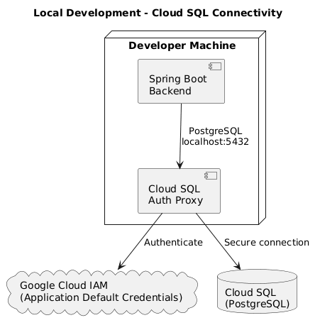
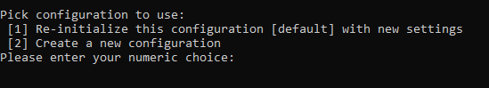
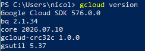
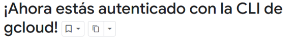
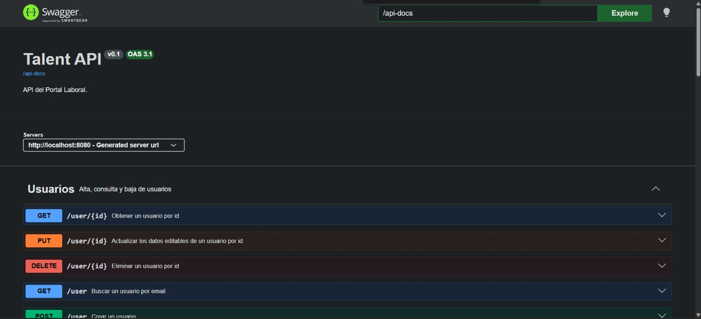

# Guía de configuración del entorno local

Esta guía describe los pasos necesarios para configurar el entorno de desarrollo y ejecutar el backend utilizando **Cloud SQL Auth Proxy**.

---

## Arquitectura

El siguiente diagrama muestra cómo el backend se conecta a una instancia de Cloud SQL desde un entorno de desarrollo local mediante Cloud SQL Auth Proxy y Application Default Credentials (ADC).



---

# 1. Instalar Google Cloud SDK

Descargar e instalar **Google Cloud SDK** desde el siguiente enlace:

https://cloud.google.com/sdk/docs/install


Durante la instalación:

- Dejar seleccionadas las opciones predeterminadas.
- Presionar **Next** en cada paso hasta finalizar la instalación.

Al finalizar, se abrirá una consola de Google Cloud para realizar la configuración inicial. No es necesario realizar ninguna acción adicional; simplemente cerrarla y continuar con la guía.



## Verificar la instalación

Ejecutar:

```bash
gcloud version
```

Si el comando devuelve la versión instalada de Google Cloud SDK, la instalación fue exitosa.



---

# 2. Iniciar sesión

Autenticarse con una cuenta de Google que tenga acceso al proyecto.

```bash
gcloud auth login
```

Se abrirá el navegador para completar el inicio de sesión.


---

# 3. Configurar Application Default Credentials (ADC)

Ejecutar:

```bash
gcloud auth application-default login
```

Luego verificar la configuración:

```bash
gcloud auth application-default print-access-token
```

Si el comando devuelve un token de acceso, las credenciales fueron configuradas correctamente.

---

# 4. Obtener la ruta de las credenciales

En **Windows**, el archivo normalmente se encuentra en:

```text
C:\Users\<USUARIO>\AppData\Roaming\gcloud\application_default_credentials.json
```

En **macOS/Linux**, normalmente se encuentra en:

```text
~/.config/gcloud/application_default_credentials.json
```

## Formas de localizar el archivo (Windows)

### Explorador de archivos

Pegar la siguiente ruta en la barra de direcciones:

```text
%APPDATA%\gcloud
```

### PowerShell

```powershell
explorer $env:APPDATA\gcloud
```

---

# 5. Configurar el archivo `.env`

Copiar el archivo `.env.example` y crear un archivo `.env` en el directorio raíz del backend.

Completar las siguientes variables:

> **Importante:** Antes de ejecutar el proyecto, cada desarrollador debe solicitar al equipo de Infra su usuario y contraseña de PostgreSQL, así como el usuario y la contraseña de Flyway correspondientes al entorno con el que va a trabajar.

```env
POSTGRES_USER=<usuario_asignado>
POSTGRES_PASSWORD=<contraseña_asignada>

FLYWAY_USER=<usuario_flyway_del_entorno>
FLYWAY_PASSWORD=<contraseña_flyway>

GOOGLE_APPLICATION_CREDENTIALS_HOST=C:/Users/<USUARIO>/AppData/Roaming/gcloud/application_default_credentials.json
```

Los usuarios de Flyway varían según el entorno:

| Entorno | FLYWAY_USER |
|----------|-------------|
| DEV | `flyway_dev` |
| QA | `flyway_qa` |
| PROD | `flyway_prod` |

> **Nota:** En Windows utilizar `/` en lugar de `\` en la ruta de `GOOGLE_APPLICATION_CREDENTIALS_HOST`.

---

# 6. Levantar el proyecto

Ejecutar:

```bash
docker compose up --build
```

La primera ejecución puede demorar algunos minutos mientras Docker descarga las imágenes necesarias y construye los contenedores.

---

# 7. Verificación

Si la configuración fue realizada correctamente, en los logs deberían aparecer mensajes similares a los siguientes:

```text
The proxy has started successfully
Successfully validated X migrations
Schema "public" is up to date
Started TalentApplication
```

Una vez iniciado el backend, acceder a **Swagger** y verificar que los endpoints respondan correctamente.

```
http://localhost:8080/swagger-ui/index.html
```

