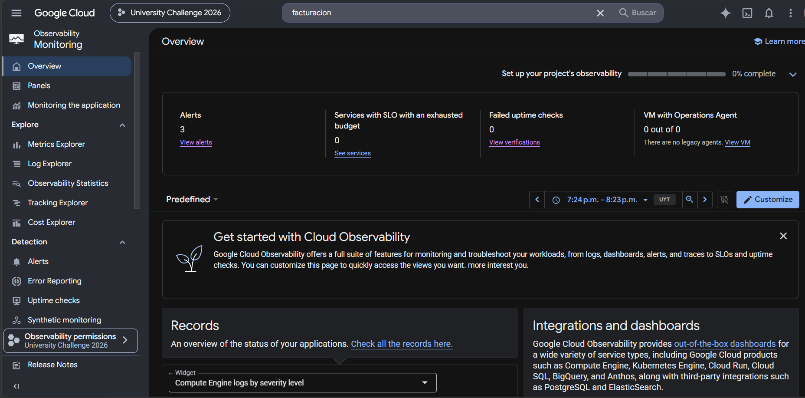
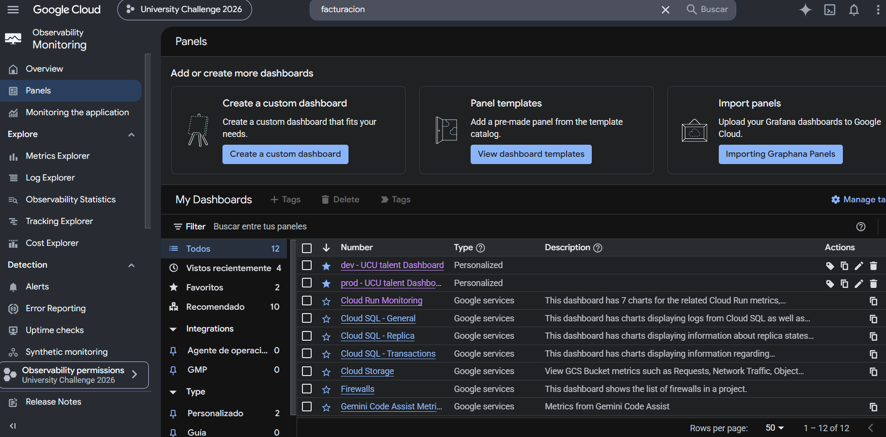
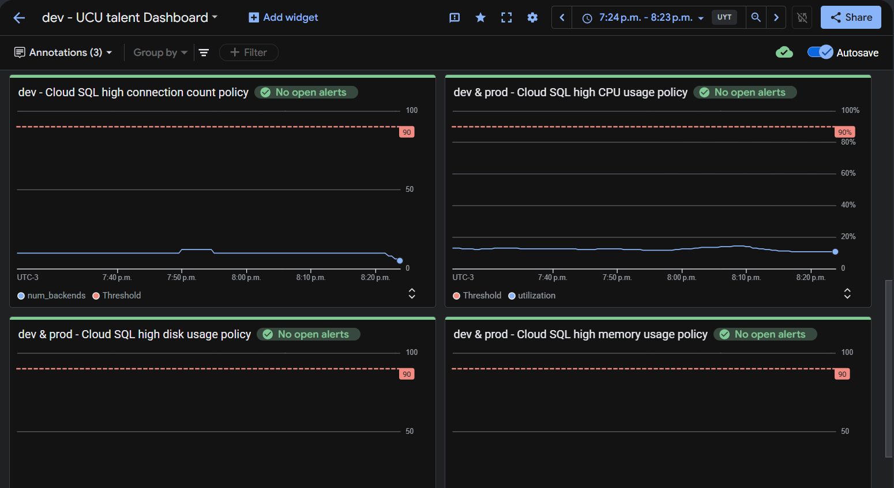
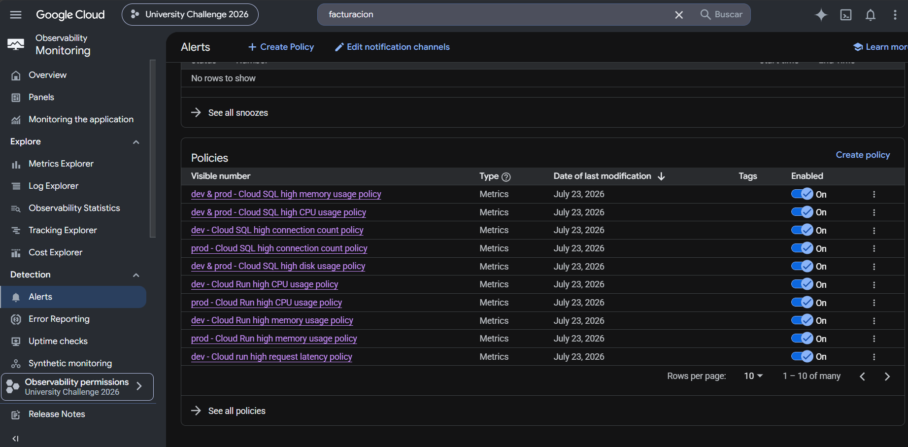
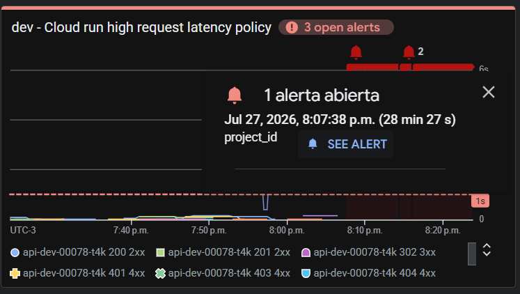
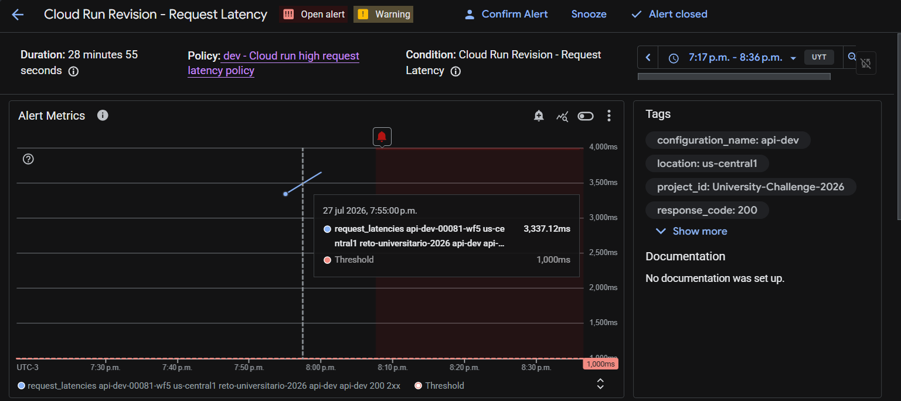
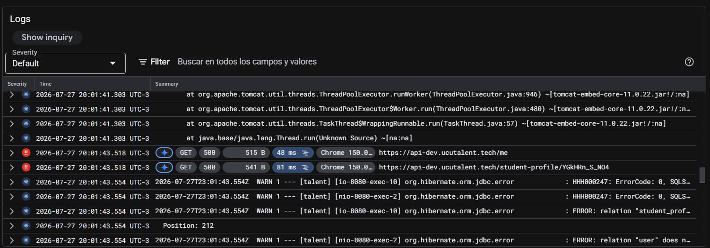
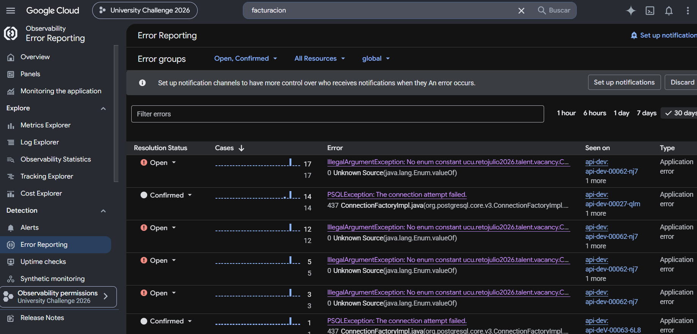

# Guía de uso de Cloud Monitoring

Esta guía describe el uso de Cloud Monitoring para supervisar la infraestructura desplegada en Google cloud Platform (GCP). A través de esta herramienta es posible visualizar el estado de los recursos, consultar métricas, revisar alertas e investigar incidentes mediante los registros del sistema.

---

## Acceder a Cloud Monitoring

1. Ingresar a Google cloud Planform.
2. En el menú lateral izquierdo seleccionar **Monitoring**.

Una vez dentro de Cloud Monitoring se visualizará el panel proncipal, donde es posible acceder a los dashboards, las alertas y las métricas de la infraestructura.

---

## Visualizar los Dashboards

En el menú lateral izquierdo seleccionar **Panels**.

Se desplegaran los dashboards disponibles para cada anbiente del proyecto.

- **dev - UCU talent Dashboard**
- **prod - UCU talent Dashboard**

Cada dashboard reúne la principakes métricas de Cloud Run y Cloud SQL, permitiendo monitorear el estado de los recursos en tiempo real.

---

## Consultar las métricas

Al ingresar a un dashboard se visualizarán diferentes gráficos que representan el comportamiento de los recursos de cloud Run y Cloud SQL.

Entre las principales métricas se encuentran:

- Utilización de CPU.
- Utilización de memoria.
- Latencia de las solicitudes (Request Latency).
- Errores HTTP 5xx.
- Cantidad de conexiones a Cloud SQL.
- Utilización del disco de Cloud SQL.

Estas metricas permiten detectar comportamientos fuera de lo normal y verificar el estado original de la infraestructura.

---

## Consultar las metricas

Para visualizar las alartas configuradas, en el menú lateral izquierdo seleccionar **Alerts**

En esta seccion se muestran todas las Alerts Policies creadas para la infraestructura, indicando si acualmente existe algún incidente activo o si las alertas ya fueron resueltas.

---

## Analizar un incidente

Cuando una alerta se activa, seleccionar el incidente en donde dice **SEE ALERT** para visualizar información adicional, donde se podrá encontrar:

- Nombre de la política.
- Recurso afectado.
- Fecha y hora de activación.
- Estado del incidente.
- Gráfico con la métrica que generó la alerta.

Esta informacion permite detectar si el comportamiento observado corresponde a un evento putual o si requiere una investigación mas profunda.

---

## Revisar los registros asociafos

Desde el incidente es posible acceder directamente a los registros relacionados en la sección **Logs**

En Cloud Logging se pueden revisar los eventos generados por el recurso afectado para identificar advertencias, errores o excepciones que puedan estar relacionadas con la alerta.

Durante el análisis es recomendable verificar:

- Advertencias (Warnings).
- Errores (Errors).
- Excepciones registradas por la aplicación.
- Códigos de respuesta HTTP.
- Mensajes relacionados con el recurso afectado.

---

## Verificar Error Reporting

Si durnte la revision de los logs se detectan excepciones, estas también pueden consultarse desde **Error Reporting**.

Esta herramienta agrupa automaticamente las excepciones generadas por la aplicación, facilitando su análisis y permitiendo identificar errores repetitivos.

Es importante determinar si la excepción corresponde a un problema de infraestructura o a un error de la aplicación para derivar el incidente al equipo correspondiente.

---