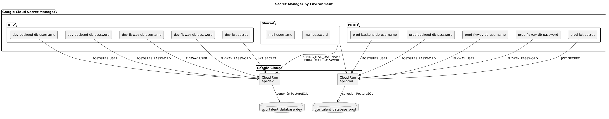

# Secret Manager

## Objetivo

Google Cloud Secret Manager se utiliza para almacenar de forma segura las credenciales utilizadas por la infraestructura y las aplicaciones, evitando incluir información sensible en el código fuente, archivos de configuración o variables de entorno.

---

## Arquitectura

El siguiente diagrama muestra cómo se organizan los secretos por entorno y qué componentes de la infraestructura consumen cada uno de ellos.



---

# Secretos utilizados

| Nombre | Descripción |
|---------|-------------|
| `dev-backend-db-username` | Usuario PostgreSQL utilizado por la aplicación Backend del entorno DEV. |
| `dev-backend-db-password` | Contraseña del usuario utilizado por la aplicación Backend del entorno DEV. |
| `dev-flyway-db-username` | Usuario PostgreSQL utilizado por Flyway para ejecutar migraciones en DEV. |
| `dev-flyway-db-password` | Contraseña del usuario utilizado por Flyway en DEV. |
| `dev-jwt-secret` | Clave secreta utilizada para la generación y validación de tokens JWT en DEV. |
| `prod-backend-db-username` | Usuario PostgreSQL utilizado por la aplicación Backend del entorno PROD. |
| `prod-backend-db-password` | Contraseña del usuario utilizado por la aplicación Backend del entorno PROD. |
| `prod-flyway-db-username` | Usuario PostgreSQL utilizado por Flyway para ejecutar migraciones en PROD. |
| `prod-flyway-db-password` | Contraseña del usuario utilizado por Flyway en PROD. |
| `prod-jwt-secret` | Clave secreta utilizada para la generación y validación de tokens JWT en PROD. |
| `postgres-db-password` | Contraseña del usuario administrador de PostgreSQL utilizada para tareas administrativas sobre la instancia Cloud SQL. |
| `GCP_SA_KEY` | Credencial utilizada para autenticación con Google Cloud desde procesos automatizados como CI/CD. |
| `mail-username` | Usuario utilizado para la configuración del servicio de correo electrónico. |
| `mail-password` | Contraseña utilizada para la autenticación del servicio de correo electrónico. |

---

# Configuración recomendada

Al crear un secreto, utilizar la configuración por defecto.

---

# Organización

Se utiliza la siguiente convención de nombres:

```text
dev-backend-db-username
dev-backend-db-password
dev-flyway-db-username
dev-flyway-db-password


prod-backend-db-username
prod-backend-db-password
prod-flyway-db-username
prod-flyway-db-password

postgres-db-password
```

Esta convención permite diferenciar fácilmente:

- entorno (`dev`, `prod`)
- servicio (`backend`, `flyway`, `postgres`)
- tipo de credencial (`username`, `password`)

---

# Procedimiento para crear un secreto

1. Ingresar a Google Cloud Console.
2. Ir a Security → Secret Manager.
3. Seleccionar Create Secret.
4. Completar:

**Nombre**

Ejemplo:

```text
dev-backend-db-password
```

**Valor secreto**

Ingresar el valor correspondiente.

5. Mantener la configuración por defecto.
6. Presionar Create Secret.

---

# Acceso

Los secretos deben otorgarse únicamente a las cuentas de servicio o usuarios que realmente los necesiten, siguiendo el principio de mínimo privilegio.

Las credenciales de uso personal de los desarrolladores y testers no se almacenan en Secret Manager, ya que son utilizadas únicamente para conexiones manuales a la base de datos y no por la infraestructura o las aplicaciones.